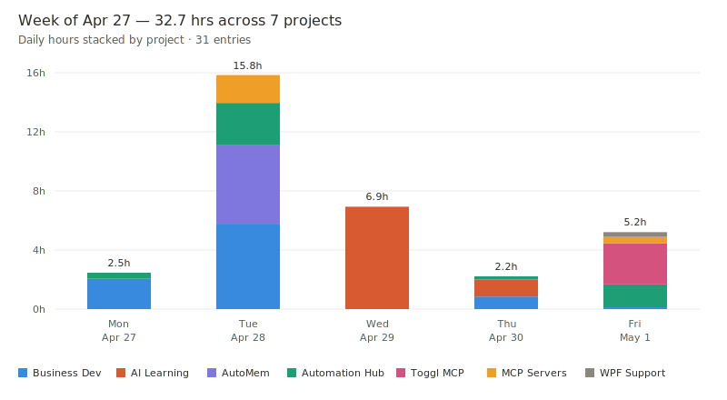
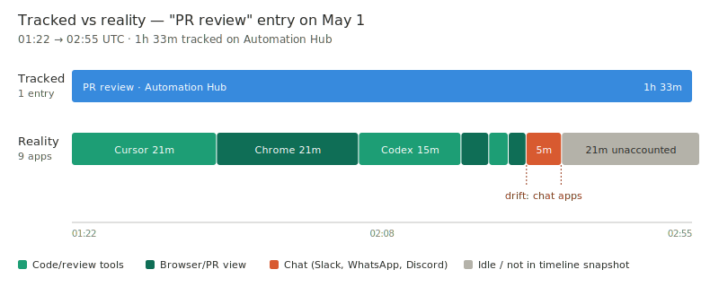
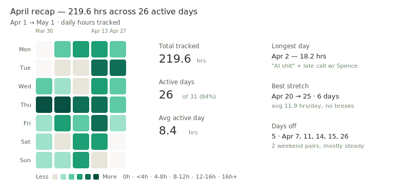

# MCP Toggl

> Talk to your time tracking. Pull reports, start timers, inspect desktop activity, and turn raw Toggl data into useful recaps from Claude or any MCP-compatible client.

[](https://www.npmjs.com/package/@verygoodplugins/mcp-toggl)
[](https://modelcontextprotocol.io)
[](LICENSE)
[](https://developers.track.toggl.com/docs/)

## See What Your Week Actually Looked Like

> You ask: "Give me the recap of my week"

The MCP server returns hydrated time entries with project, workspace, client, tag, and running-timer context. Your client can turn that into a readable recap:

> 32.7 hours across 31 entries and 7 projects. Monday was a light planning day, Tuesday had the long implementation block, Wednesday stayed focused on one project, and Friday turned into a shipping run. The top project took 27% of the week, with two smaller projects close behind.



The server does not hard-code this prose or chart. It exposes structured Toggl data in a shape that makes synthesis easy.

## Catch the Drift

> You ask: "Did I actually work on what I said I worked on for that PR review entry?"

`toggl_get_timeline` can compare a tracked entry boundary with Toggl Track Desktop activity:

> The entry ran 1h 33m. About 67 minutes were in review tools, 5 minutes were scattered across chat apps, and the rest was idle or trimmed timeline space. The entry mostly checks out.



This is useful before invoicing, after long context-switching days, or whenever a vague entry like "admin" starts hiding too much Slack and browser time.

## See Patterns Over Time

> You ask: "Show me last month at a glance"

Daily and weekly report tools make it straightforward for the client to render heatmaps, spot streaks, and surface intensity changes:



Toggl is still the source of truth. The MCP layer makes the data easier for an agent to inspect, summarize, and visualize.

## Things You Can Ask

```text
What am I currently tracking?
How much time did I spend on the website project this month?
Start a timer for "PR review" on the Platform project
Show me yesterday's hours as a chart
What apps did I use most today?
Generate a daily report for last Friday
Compare this week to last week by project
Which day this month had the most billable work?
```

Chart prompts depend on your MCP client. The server returns the structured data; clients such as Claude decide how to render it.

## What Makes This Useful

**Hydrated responses**: time entries are enriched with `project_name`, `client_name`, `workspace_name`, `tag_names`, and normalized running-timer fields so the client does not need a second lookup for ordinary reporting.

**Smart caching**: workspaces, projects, clients, tasks, and tags are cached after first read. `toggl_cache_stats` shows hits, misses, loaded entities, and hit rate.

**Desktop activity timeline**: `toggl_get_timeline` summarizes app usage from Toggl Track Desktop and can return raw events when you need sequence analysis.

**Privacy controls**: timeline calls support summary-only output with `include_events: false` and title redaction with `redact_titles: true`.

**Period shortcuts**: `today`, `yesterday`, `week`, `lastWeek`, `month`, and `lastMonth` are supported on the tools where those periods make sense.

**Recoverable errors**: workspace resolution errors include `available_workspaces`, and Toggl quota/rate-limit errors include structured retry hints.

## Quick Start

### Prerequisites

- Node.js `^20.19.0` or `>=22.12.0`
- A Toggl Track account
- Your Toggl API token from [track.toggl.com/profile](https://track.toggl.com/profile)

### Claude Desktop

Add this to `~/Library/Application Support/Claude/claude_desktop_config.json`:

```json
{
  "mcpServers": {
    "mcp-toggl": {
      "command": "npx",
      "args": ["-y", "@verygoodplugins/mcp-toggl@latest"],
      "env": {
        "TOGGL_API_KEY": "your_api_key_here",
        "TOGGL_DEFAULT_WORKSPACE_ID": "123456"
      }
    }
  }
}
```

`TOGGL_DEFAULT_WORKSPACE_ID` is optional. If you have exactly one Toggl workspace, the server can resolve it automatically. If you have multiple workspaces and do not set a default, workspace-scoped tools return the available workspace IDs so the client can retry with `workspace_id`.

Restart Claude Desktop, then ask:

```text
What am I currently tracking?
```

### Global Install

```bash
npm install -g @verygoodplugins/mcp-toggl
mcp-toggl --help
```

## Tools

### Reports and Insights

| Tool | What it does |
| --- | --- |
| `toggl_daily_report` | Hours by project and workspace for a date. Use `format: "text"` for display text or `"json"` for structured output. |
| `toggl_weekly_report` | 7-day breakdown with daily totals and project rollups. Use `week_offset: -1` for last week. |
| `toggl_get_time_entries` | Raw hydrated entries by period, date range, workspace, or project. |
| `toggl_get_timeline` | Toggl Track Desktop app usage summary with optional raw events. |

### Timer Control

| Tool | What it does |
| --- | --- |
| `toggl_get_current_entry` | Returns the running timer, elapsed seconds, and hydrated project/workspace context. |
| `toggl_start_timer` | Starts a timer with description, optional project/task, and tags. |
| `toggl_stop_timer` | Stops the currently running timer. |

### Lookups

| Tool | What it does |
| --- | --- |
| `toggl_check_auth` | Verifies token access and lists available workspaces without exposing the token. |
| `toggl_list_workspaces` | Lists all accessible workspaces. |
| `toggl_list_projects` | Lists projects for a workspace using cache-backed reads after first fetch. |
| `toggl_list_clients` | Lists clients for a workspace using cache-backed reads after first fetch. |
| `toggl_list_tags` | Lists tags for a workspace using cache-backed reads after first fetch. |

### Tag Management

| Tool | What it does |
| --- | --- |
| `toggl_create_tag` | Creates a tag in a workspace. Invalidates cached tag listings. |
| `toggl_update_tag` | Renames an existing tag. Invalidates cached tag listings. |
| `toggl_delete_tag` | Deletes a tag from a workspace. Invalidates cached tag listings. |

### Cache Management

| Tool | What it does |
| --- | --- |
| `toggl_warm_cache` | Pre-fetches workspace, project, client, and tag data before a heavy reporting session. |
| `toggl_cache_stats` | Returns hits, misses, hit rate, loaded entity counts, and warm-cache state. |
| `toggl_clear_cache` | Clears cached data. Useful after creating or renaming Toggl entities. |

### Summaries

| Tool | What it does |
| --- | --- |
| `toggl_project_summary` | Total hours per project for a period or date range. |
| `toggl_workspace_summary` | Total hours per workspace for a period or date range. |

## Timeline Privacy

Toggl Track Desktop activity can include window titles. Those titles may contain document names, email subjects, chat text, URLs, OAuth pages, or database names.

Summary-only mode returns app totals without raw events:

```json
{
  "period": "today",
  "include_events": false
}
```

Events with redacted titles preserve sequence and duration but remove titles:

```json
{
  "period": "today",
  "redact_titles": true,
  "limit": 50
}
```

Full event mode is the default:

```json
{
  "period": "today"
}
```

When in doubt, use `include_events: false`.

## Configuration Reference

| Env var | Required | Default | Notes |
| --- | --- | --- | --- |
| `TOGGL_API_KEY` | Yes | - | Preferred env var for your Toggl API token. |
| `TOGGL_API_TOKEN` | No | - | Supported alias for backwards compatibility. `TOGGL_API_KEY` is preferred. |
| `TOGGL_TOKEN` | No | - | Supported alias for backwards compatibility. `TOGGL_API_KEY` is preferred. |
| `TOGGL_DEFAULT_WORKSPACE_ID` | No | - | Used when a tool requires a workspace and none is passed. |
| `TOGGL_CACHE_TTL` | No | `3600000` | Cache TTL in milliseconds. Default is 1 hour. |
| `TOGGL_CACHE_SIZE` | No | `1000` | Maximum cached entity budget. |
| `TOGGL_BATCH_SIZE` | No | `100` | Batch size used by API pagination helpers. |

## Caveats

**Toggl rate limits and quotas**: Toggl may return rate-limit or quota errors during chatty sessions. The server returns structured retry information when Toggl provides it. Warm the cache before large reporting sessions to avoid repeated project/client/tag fetches.

**Running timer duration**: Toggl uses negative duration values for running entries. Read `running` and `elapsed_seconds` from the hydrated response instead.

**Timeline availability**: `toggl_get_timeline` requires Toggl Track Desktop timeline sync. If it is not enabled or has not uploaded data yet, the tool returns `enabled: false` with setup guidance.

**Timeline totals**: `limit` only limits returned raw events. `summary`, `total_seconds`, and `total_hours` are calculated from all matching events.

## Local Development

```bash
git clone https://github.com/verygoodplugins/mcp-toggl.git
cd mcp-toggl
npm install
npm run build
npm test
```

Useful commands:

```bash
npm run dev
npm run lint
npm run format
```

## License

MIT.

Built by [Very Good Plugins](https://verygoodplugins.com).
